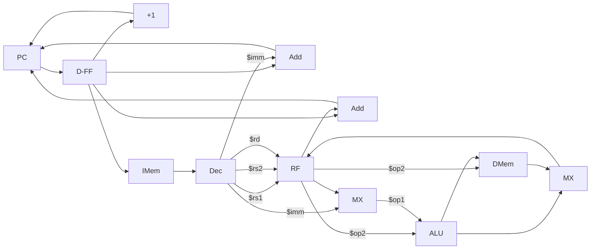

# RISC-V CPU Core
## About
This project implements CPU Core which can execute all the instructions of base RISC-V instruction set (RV32I). This core executes each instruction in a single clock. 

## Diagram

## Reference
This project is based on a edX course [Building a RISC-V CPU Core](https://learning.edx.org/course/course-v1:LinuxFoundationX+LFD111x+1T2021/home) served by the Linux foundation.
